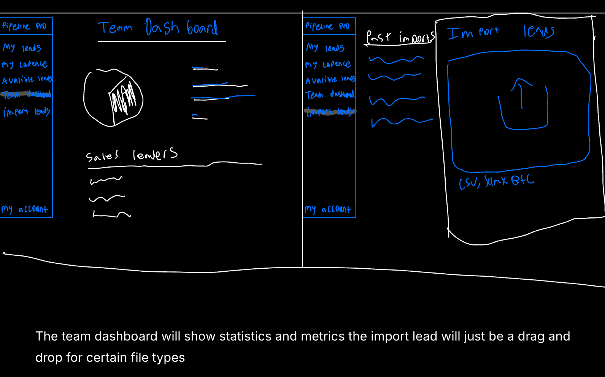
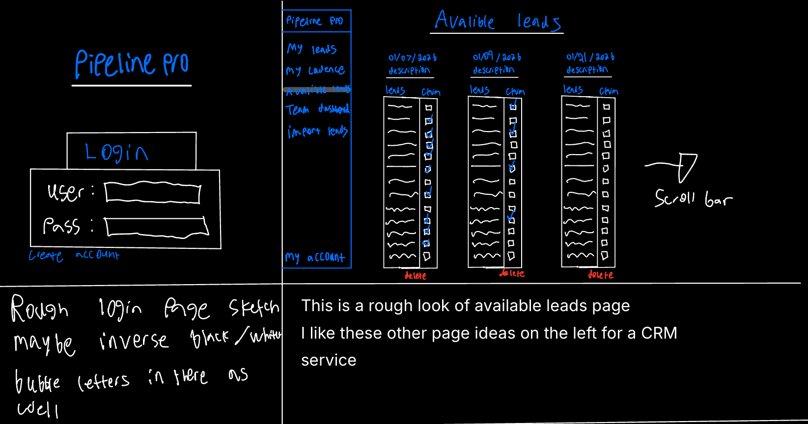
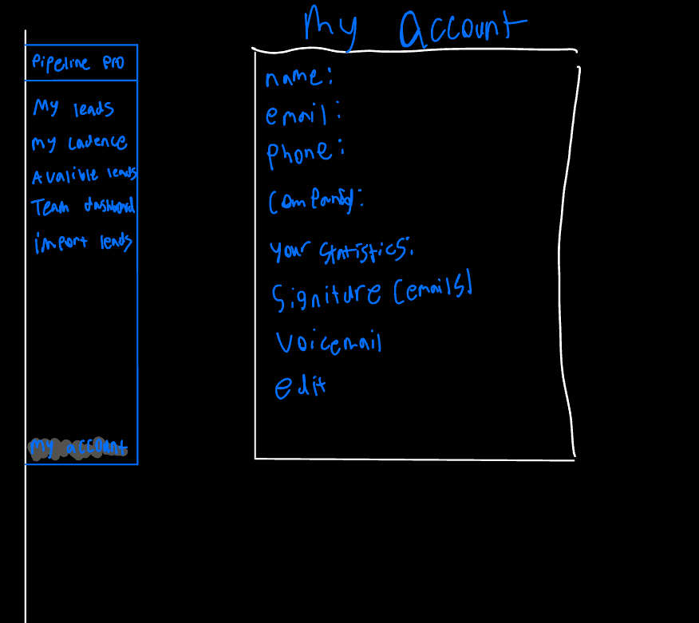
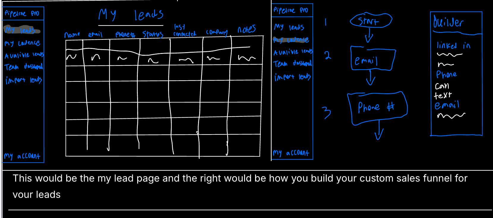
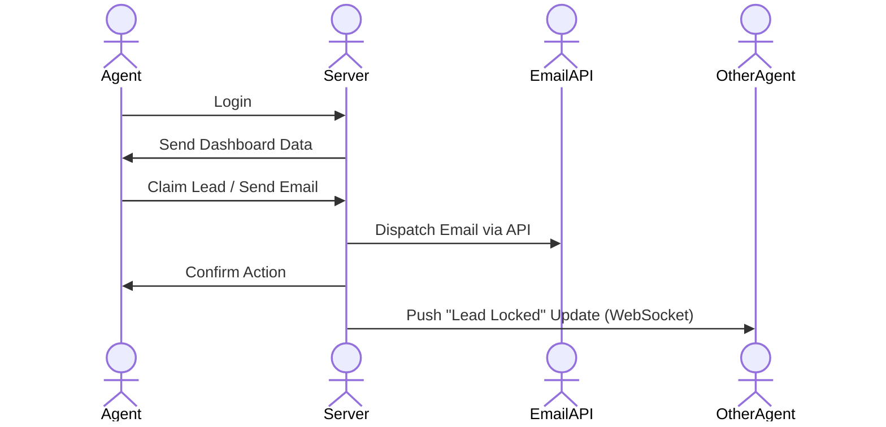

# PipelinePro

[My Notes](notes.md)

PipelinePro is a collaborative, real-time CRM that combines lead tracking with integrated communication tools for small sales teams.

## 🚀 Specification Deliverable

For this deliverable I did the following. I checked the box `[x]` and added a description for things I completed.

- [x] Proper use of Markdown - I used headings, lists, bold text, and code blocks to format this README file.

- [x] A concise and compelling elevator pitch - I wrote a pitch for PipelinePro focusing on the CRM aspects and why CRM's need to do more.

- [x] Description of key features - I listed features like the live claim board, email integration, and team sync.

- [x] Description of how you will use each technology - I explained how React, WebSockets, and the Mailgun API will be implemented.

- [x] One or more rough sketches of your application. Images must be embedded in this file using Markdown image references. - I drew the Login and Dashboard views and embedded the images below.

### Elevator pitch

Most CRMs are just glorified spreadsheets. PipelinePro is a real-time command center where sales teams can track leads, log calls, and send emails directly from the dashboard. By syncing data instantly across all users, it prevents agents from double-contacting leads and keeps the entire team's communication history in one unified view.

### Design

The images above illustrate the seven main screens: the Dashboard, Import leads, the Available Leads pool, User Account settings, the Cadence Builder, the current leads page, and the login page. The diagram below details the backend data flow.

### Key features

- Live claim board for leads. Depending on the sales job it is very easy to use web crawlers to gather massive amount of leads. A live claim board will give everyone access to larger searches. 

- Integrated Emailing: Agents can send follow-up emails directly from the lead card without leaving the app.

- Interaction History: Automatically logs every email sent and note taken so any team member can see the full context of a relationship.

- Team Sync: Real-time updates prevent two salespeople from working the same lead at the same time.

- Secure Multi-User Login: Agents log in to view their team's specific private data.

- Also what to make customizable cadences for steps. 

### Technologies

I am going to use the required technologies in the following ways.

- **HTML** - Uses standard HTML structure for the application. Three main views: Login, Dashboard

- **CSS** - Styling for the application to look clean and professional (SaaS aesthetic). Uses whitespace and contrasting colors to differentiate lead statuses.

- **React** - Single Page Application (SPA) structure using React Router. Components for LeadCard, EmailForm, and HistoryLog.

- **Service** - Backend service with endpoints for Login/Register, retrieving leads, saving notes, and triggering emails.

- **DB/Login** - Stores users (sales agents), Leads, and a "History" table that tracks every email sent or note added to a lead.

- **WebSocket** - When User A claims a card/lead other uses free leads are silently updated. When a sales call is marked as successful a notification is broadcast to all other connected users for commperirive purposes. 

- **3rd Party API** - Integrates with a transactional email service (Mailgun) to send actual emails to leads when the agent clicks "Send" in the dashboard.

## 🚀 AWS deliverable

For this deliverable I did the following. I checked the box `[x]` and added a description for things I completed.

- [ ] **Server deployed and accessible with custom domain name** - [My server link](https://yourdomainnamehere.click).

## 🚀 HTML deliverable

For this deliverable I did the following. I checked the box `[x]` and added a description for things I completed.

- [ ] **HTML pages** - I did not complete this part of the deliverable.
- [ ] **Proper HTML element usage** - I did not complete this part of the deliverable.
- [ ] **Links** - I did not complete this part of the deliverable.
- [ ] **Text** - I did not complete this part of the deliverable.
- [ ] **3rd party API placeholder** - I did not complete this part of the deliverable.
- [ ] **Images** - I did not complete this part of the deliverable.
- [ ] **Login placeholder** - I did not complete this part of the deliverable.
- [ ] **DB data placeholder** - I did not complete this part of the deliverable.
- [ ] **WebSocket placeholder** - I did not complete this part of the deliverable.

## 🚀 CSS deliverable

For this deliverable I did the following. I checked the box `[x]` and added a description for things I completed.

- [ ] **Visually appealing colors and layout. No overflowing elements.** - I did not complete this part of the deliverable.
- [ ] **Use of a CSS framework** - I did not complete this part of the deliverable.
- [ ] **All visual elements styled using CSS** - I did not complete this part of the deliverable.
- [ ] **Responsive to window resizing using flexbox and/or grid display** - I did not complete this part of the deliverable.
- [ ] **Use of a imported font** - I did not complete this part of the deliverable.
- [ ] **Use of different types of selectors including element, class, ID, and pseudo selectors** - I did not complete this part of the deliverable.

## 🚀 React part 1: Routing deliverable

For this deliverable I did the following. I checked the box `[x]` and added a description for things I completed.

- [ ] **Bundled using Vite** - I did not complete this part of the deliverable.
- [ ] **Components** - I did not complete this part of the deliverable.
- [ ] **Router** - I did not complete this part of the deliverable.

## 🚀 React part 2: Reactivity deliverable

For this deliverable I did the following. I checked the box `[x]` and added a description for things I completed.

- [ ] **All functionality implemented or mocked out** - I did not complete this part of the deliverable.
- [ ] **Hooks** - I did not complete this part of the deliverable.

## 🚀 Service deliverable

For this deliverable I did the following. I checked the box `[x]` and added a description for things I completed.

- [ ] **Node.js/Express HTTP service** - I did not complete this part of the deliverable.
- [ ] **Static middleware for frontend** - I did not complete this part of the deliverable.
- [ ] **Calls to third party endpoints** - I did not complete this part of the deliverable.
- [ ] **Backend service endpoints** - I did not complete this part of the deliverable.
- [ ] **Frontend calls service endpoints** - I did not complete this part of the deliverable.
- [ ] **Supports registration, login, logout, and restricted endpoint** - I did not complete this part of the deliverable.

## 🚀 DB deliverable

For this deliverable I did the following. I checked the box `[x]` and added a description for things I completed.

- [ ] **Stores data in MongoDB** - I did not complete this part of the deliverable.
- [ ] **Stores credentials in MongoDB** - I did not complete this part of the deliverable.

## 🚀 WebSocket deliverable

For this deliverable I did the following. I checked the box `[x]` and added a description for things I completed.

- [ ] **Backend listens for WebSocket connection** - I did not complete this part of the deliverable.
- [ ] **Frontend makes WebSocket connection** - I did not complete this part of the deliverable.
- [ ] **Data sent over WebSocket connection** - I did not complete this part of the deliverable.
- [ ] **WebSocket data displayed** - I did not complete this part of the deliverable.
- [ ] **Application is fully functional** - I did not complete this part of the deliverable.
